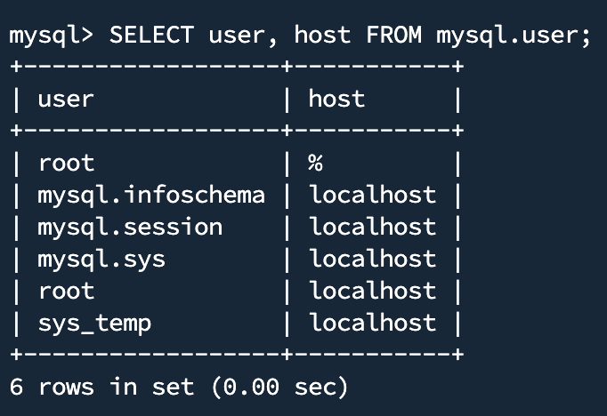
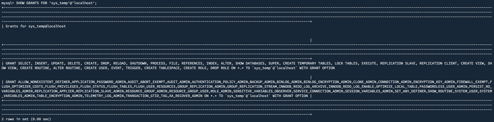
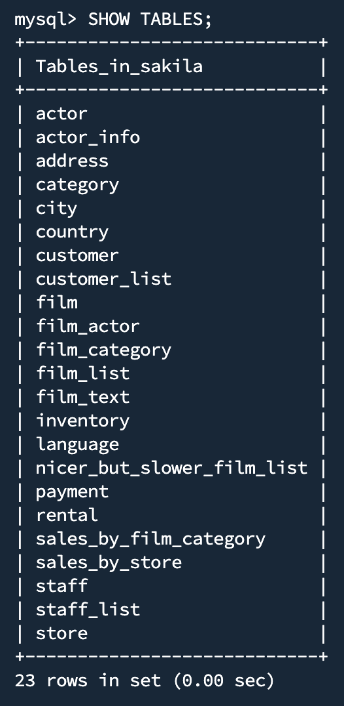
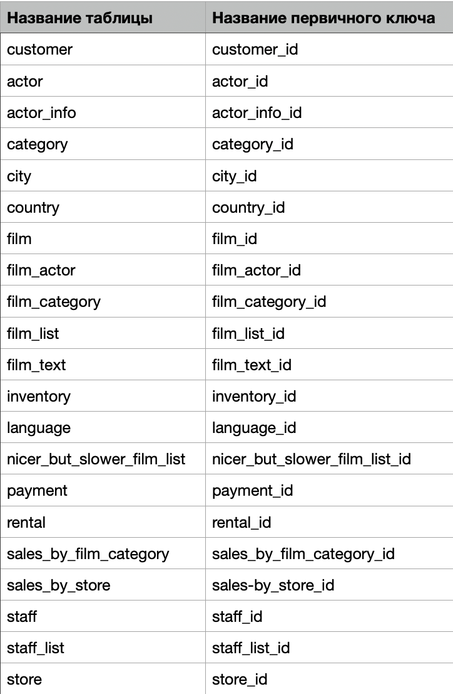

# Домашнее задание к занятию "Работа с данными (DDL/DML)" - Исмагилов Эжен

### Задание 1

1.1 Поднимаю чистый инстанс MYSQL в контейнере Docker:

```bash
docker run --name mysql8 -e MYSQL_ROOT_PASSWORD=root -d mysql:8
```

1.2 Создаю учетную запись *sys_temp*:

```bash
docker exec -it mysql8 bash 
mysql -u root -p
```
```mysql
CREATE USER 'sys_temp'@'localhost' IDENTIFIED BY 'password';
```

1.3 Запрос на получение списка пользователей в базе данных:

```mysql
SELECT user, host FROM mysql.user;
```



1.4 Выдаю все права пользователю *sys_temp*:

```mysql
GRANT ALL PRIVILEGES ON *.* TO 'sys_temp'@'localhost' WITH GRANT OPTION;
```

1.5 Запрос на получение списка прав для пользователя *sys_temp*;

```mysql
SHOW GRANTS FOR 'sys_temp'@'localhost';
```



1.6 Скачиваю и распаковываю дамп базы данных:

```bash
wget https://downloads.mysql.com/docs/sakila-db.zip 
unzip sakila-db.zip
# Копирую файлы в контейнер
sudo docker cp ~/sakila-db/sakila-schema.sql mysql:/sakila-schema.sql
sudo docker cp ~/sakila-db/sakila-data.sql mysql:/sakila-data.sql
```
1.7 Восстанавливаю дамп базы данных:

```mysql
SOURCE sakila-schema.sql;
SOURCE sakila-data.sql;
```

1.8 Все таблицы базы данных:

```mysql
SHOW TABLES;
```



---

### Задание 2


